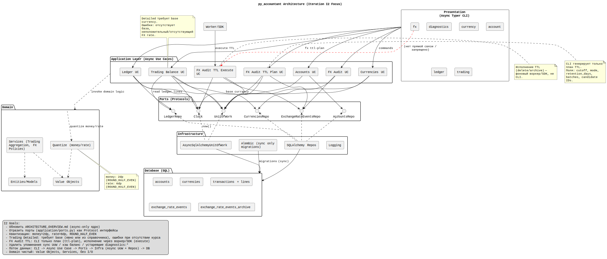

# py-accountant

Чистая архитектура для бухгалтерского ядра на Python 3.13+ и SQLAlchemy 2.x. Слои: Domain / Application / Infrastructure. Исторические детали см. в Migration History.

- Язык: Python 3.13+
- ORM: SQLAlchemy 2.x
- Тесты: Pytest
- Линт/формат: Ruff
- Зависимости: Poetry

## ENV переменные: runtime async, миграции sync

По умолчанию используется единый `.env`, в котором значения можно задавать напрямую или в неймспейсе SDK (`PYACC__`). Пример ключей:
- `DATABASE_URL` / `PYACC__DATABASE_URL` — синхронный URL для Alembic миграций (пример: `postgresql+psycopg://...`, `sqlite+pysqlite:///./dev.db`).
- `DATABASE_URL_ASYNC` / `PYACC__DATABASE_URL_ASYNC` — асинхронный URL для рантайма (пример: `postgresql+asyncpg://...`, `sqlite+aiosqlite://...`).
- `LOG_LEVEL` / `PYACC__LOG_LEVEL`, `JSON_LOGS`, `LOGGING_ENABLED` и др. — настройки логирования и ttl (см. `docs/INTEGRATION_GUIDE.md`).

Порядок:
- Перед запуском приложения выполните миграции: `poetry run alembic upgrade head` (читает DATABASE_URL).
- Приложение/воркеры используют DATABASE_URL_ASYNC. Если он не задан ни напрямую, ни в виде `PYACC__DATABASE_URL_ASYNC`, рантайм нормализует sync URL в async.
- Чтобы отключить встроенную настройку логирования SDK, установите `LOGGING_ENABLED=false` (или `PYACC__LOGGING_ENABLED=false`).

## Configuration Environment Guide

### 1. Базовая структура `.env`
Рекомендуется хранить настройки бота и `py_accountant` в одном `.env`, используя префикс `PYACC__` для всех переменных SDK. Такой подход даёт два преимущества:
- визуально отделяет настройки интегратора от ядра бухгалтерии;
- упрощает передачу секретов в CI/CD (можно скопировать одну группу переменных).

Минимальный `.env`:
```
TELEGRAM_BOT_TOKEN=bot-token
BOT__RATE_LIMIT=10
PYACC__DATABASE_URL=sqlite+pysqlite:///./dev.db
PYACC__DATABASE_URL_ASYNC=sqlite+aiosqlite:///./dev.db
PYACC__LOG_LEVEL=DEBUG
PYACC__LOGGING_ENABLED=true
```

### 2. Карта переменных py_accountant
| Назначение | Переменная | Комментарии |
|------------|-----------|-------------|
| Sync URL для миграций | `DATABASE_URL` / `PYACC__DATABASE_URL` | Используется Alembic и любые sync-утилиты. Допустимы Postgres/SQLite sync драйверы. |
| Async URL рантайма | `DATABASE_URL_ASYNC` / `PYACC__DATABASE_URL_ASYNC` | Основной источник для SDK/UoW. При отсутствии — нормализация из sync URL. |
| Уровень логов | `LOG_LEVEL` / `PYACC__LOG_LEVEL` | `DEBUG`, `INFO`, `WARNING`, ... |
| Формат логов | `JSON_LOGS` / `PYACC__JSON_LOGS` | `true` включает JSON + опциональный файл/ротацию. |
| Включение логгера | `LOGGING_ENABLED` / `PYACC__LOGGING_ENABLED` | `false` пропускает bootstrap логирования, если хост управляет логами сам. |
| TTL FX Audit | `FX_TTL_*` / `PYACC__FX_TTL_*` | `MODE`, `RETENTION_DAYS`, `BATCH_SIZE`, `DRY_RUN`. |
| Параметры БД (POOL, TIMEOUT, RETRY) | `DB_*` / `PYACC__DB_*` | Управляют async-пулом SQLAlchemy. |

### 3. Разделение переменных бота и SDK
- Используйте неймспейс `BOT__` или любой другой для собственных настроек. Пример: `BOT__ADMIN_CHAT_ID`, `BOT__PAYMENTS_URL`.
- В коде бота читайте обе группы: `os.getenv("TELEGRAM_BOT_TOKEN")` и `os.getenv("BOT__ADMIN_CHAT_ID")`. Модуль SDK автоматически найдёт `PYACC__*`.

### 4. Примеры конфигураций
#### Локальная разработка (SQLite)
```
PYACC__DATABASE_URL=sqlite+pysqlite:///./dev.db
PYACC__DATABASE_URL_ASYNC=sqlite+aiosqlite:///./dev.db
PYACC__LOG_LEVEL=DEBUG
PYACC__JSON_LOGS=false
PYACC__LOGGING_ENABLED=true
```
- Миграции: `poetry run alembic upgrade head`
- SDK-пример: `PYTHONPATH=src poetry run python -m examples.telegram_bot.app`

#### Продакшен (PostgreSQL + внешний логгер)
```
PYACC__DATABASE_URL=postgresql+psycopg://ledger:***@db:5432/ledger
PYACC__DATABASE_URL_ASYNC=postgresql+asyncpg://ledger:***@db:5432/ledger
PYACC__JSON_LOGS=true
PYACC__LOG_FILE=/var/log/py_accountant.json
PYACC__LOG_ROTATION=size
PYACC__LOG_MAX_BYTES=104857600
PYACC__LOGGING_ENABLED=false  # логирование делегировано оркестратору
```
- Перед запуском воркеров вызывайте `PYTHONPATH=src poetry run alembic upgrade head` в том же окружении.

### 5. Секреты и CI/CD
- В GitHub Actions/CI вынесите все `PYACC__*` в secrets/vars и прокидывайте через `env:` на шаги миграций и тестов.
- Для контейнеров используйте `.env` файл, смонтированный в compose/k8s Secret. Пример `docker-compose.yml`:
```yaml
services:
  bot:
    env_file:
      - ./.env
    environment:
      PYACC__LOGGING_ENABLED: "false"
```
- Никогда не коммитьте `.env` с реальными данными; храните пример в `docs/.env.example` (по желанию).

### 6. Траблшутинг
- Ошибка `ValueError: DATABASE_URL required` → проверьте, что хотя бы один из ключей (`DATABASE_URL` или `PYACC__DATABASE_URL`) присутствует и доступен процессу.
- Alembic читает только sync URL. Убедитесь, что runner, выполняющий миграции, загружает тот же `.env`.
- При `LOGGING_ENABLED=false` убедитесь, что хост-приложение добавляет собственные хендлеры, иначе сообщения SDK пропадут.
- Для смены БД без перезапуска обновите переменные и перезапустите процессы — настройки читаются при старте.

### 7. Быстрая проверка окружения
```bash
python - <<'PY'
import os
for key in sorted(k for k in os.environ if k.startswith('PYACC__')):
    print(f"{key}={os.environ[key]}")
PY
```
Команда помогает убедиться, что все `PYACC__` переменные доступны перед запуском миграций или бота.

---
Следующие разделы описывают работу SDK и архитектуру.

## Установка из GitHub

### Poetry
```bash
poetry add git+https://github.com/akm77/py_accountant.git
```

Poetry сохранит зависимость в `pyproject.toml` в разделе `[tool.poetry.dependencies]`. При необходимости используйте флаг `--branch`, `--tag` или `--rev` для закрепления на конкретной версии.

### pip
```bash
pip install "git+https://github.com/akm77/py_accountant.git"
```

Если проект использует `requirements.txt`, добавьте строку:
```
git+https://github.com/akm77/py_accountant.git
```
И выполните `pip install -r requirements.txt`. Для частных форков используйте SSH URL и настройте deploy key.

## Интеграция через core

Рекомендуемый способ использования — напрямую через слои Domain/Application и порты (`application.ports`).

### 1. Подключение ядра в вашем проекте

Добавьте зависимость на репозиторий:

```bash
poetry add git+https://github.com/akm77/py_accountant.git
# или
pip install "git+https://github.com/akm77/py_accountant.git"
```

Далее в коде интегратора (например, `tgbank`):

```python
from application.use_cases_async.ledger import AsyncPostTransaction, AsyncGetAccountBalance
from application.ports import AsyncUnitOfWork  # протокол

async def post_deposit(uow_factory, clock, lines, meta):
    async with uow_factory() as uow:  # type: AsyncUnitOfWork
        use_case = AsyncPostTransaction(uow, clock)
        return await use_case.execute(lines=lines, memo="Deposit", meta=meta)

async def get_balance(uow_factory, clock, account_name: str):
    async with uow_factory() as uow:
        use_case = AsyncGetAccountBalance(uow, clock)
        return await use_case.execute(account_full_name=account_name, as_of=None)
```

Интегратор реализует свой `uow_factory: Callable[[], AsyncUnitOfWork]` и репозитории по контрактам из `application.ports`.

### 2. Реализация собственного UoW и репозиториев

Простейший каркас UoW (асинхронный, совместимый с протоколами ports):

```python
from collections.abc import Callable
from application.ports import AsyncUnitOfWork as AsyncUnitOfWorkProtocol

class MyAsyncUnitOfWork(AsyncUnitOfWorkProtocol):
    async def __aenter__(self) -> "MyAsyncUnitOfWork":
        # создать async session/connection, инициализировать репозитории
        return self

    async def __aexit__(self, exc_type, exc, tb) -> None:
        # закоммитить/откатить и закрыть сессию
        ...

    # здесь реализуются свойства/репозитории, которые ожидают use cases


def make_uow_factory(async_url: str) -> Callable[[], AsyncUnitOfWorkProtocol]:
    def factory() -> AsyncUnitOfWorkProtocol:
        return MyAsyncUnitOfWork(async_url)
    return factory
```

Таким образом, внешнее приложение контролирует persistence-слой, а `py_accountant` предоставляет только домен и сценарии.

### 3. Где искать use cases и порты

- Порты (контракты UoW/репозиториев): `src/application/ports.py`.
- Async use cases:
  - `src/application/use_cases_async/accounts.py`
  - `src/application/use_cases_async/ledger.py`
  - `src/application/use_cases_async/currencies.py`
  - `src/application/use_cases_async/trading_balance.py`
  - `src/application/use_cases_async/fx_audit.py`
  - `src/application/use_cases_async/fx_audit_ttl.py`

Подробности интеграции см. в `docs/INTEGRATION_GUIDE.md` (разделы про dual-URL и использование портов/use cases).

## Архитектура слоёв



См. docs/ARCHITECTURE_OVERVIEW.md. Кратко:
- Domain — value-объекты, сервисы (балансы, политика курсов). Чистый слой.
- Application — DTO и use case'ы. Зависит от Domain; работает через порты.
- Infrastructure — адаптеры (SQLAlchemy, Alembic, logging, settings).

Данные в JSON: Decimal → строка, datetime → ISO8601 UTC.


## FX Audit TTL (кратко)

Репозитории FX Audit теперь строго CRUD + примитивы TTL (`list_old_events`, `archive_events`, `delete_events_by_ids`). Оркестрация TTL вынесена в домен (`FxAuditTTLService`) и async use cases (`AsyncPlanFxAuditTTL`, `AsyncExecuteFxAuditTTL`). Исполнение выполняется воркером/SDK. Подробнее: `docs/FX_AUDIT.md` и раздел TTL в `docs/INTEGRATION_GUIDE.md`.

## FX Audit

См. docs/FX_AUDIT.md — таблицы exchange_rate_events + archive, индексы, политика хранения. Используйте SDK для работы с событиями курсов и TTL.

## Trading Balance и окна времени

См. docs/TRADING_WINDOWS.md — семантика окна времени, примеры использования SDK, граничные случаи.

## Parity-report (внутренний инструмент)

См. docs/PARITY_REPORT.md — спецификация формата отчёта; доступ только через SDK/use cases.

## Performance

См. docs/PERFORMANCE.md — формат отчёта JSON, инструкция запуска профиля и интерпретация полей.

## Migration History

См. docs/MIGRATION_HISTORY.md — ключевые шаги и удалённый код (историческая справка).

## Полезные ссылки
- docs/ARCHITECTURE_OVERVIEW.md
- docs/ARCHITECTURE_OVERVIEW.svg
- docs/FX_AUDIT.md
- docs/TRADING_WINDOWS.md
- docs/PARITY_REPORT.md
- docs/PERFORMANCE.md
- docs/RUNNING_MIGRATIONS.md
- docs/MIGRATION_HISTORY.md
- docs/INTEGRATION_GUIDE.md ← гид по встраиванию (core-only)
- docs/ACCOUNTING_CHEATSHEET.md ← шпаргалка по проводкам

## Полностью асинхронное ядро

Синхронные репозитории и legacy sync UoW удалены в I29 (async-only завершён). Единственный поддерживаемый путь выполнения — async через собственный UoW и use cases. Alembic по-прежнему использует sync драйверы только для миграций.

## Fast balance & turnover (denormalized aggregates)

Для ускорения получения текущего баланса и отчётов по оборотам введены две денормализованные таблицы (initiative I31):
- account_balances: O(1) чтение текущего остатка счёта (balance += Δ для каждой проводки).
- account_daily_turnovers: агрегированные дневные суммы debit_total / credit_total для быстрого построения оборотно-сальдовой ведомости.

Механика:
1. Постинг транзакции вставляет journal + строки.
2. В той же транзакции вычисляется Δ (DEBIT=+, CREDIT=-) per account и выполняется UPSERT в account_balances.
3. Группировка по (account_full_name, day UTC) агрегирует дебет/кредит и делает UPSERT в account_daily_turnovers.
4. Commit фиксирует и журнал, и агрегаты атомарно.

Fast-path AsyncGetAccountBalance:
- Если as_of отсутствует (текущий момент) → читает из account_balances, при отсутствии строки возвращает Decimal('0').
- Если требуется исторический момент (as_of < now) и snapshots ещё не реализованы → fallback к сканированию строк (DEBIT-CREDIT).

Concurrency & Idempotency:
- Одновременные постинги безопасны (один txn scope + пошаговые SELECT+INSERT/UPDATE).
- Idempotency key в journals гарантирует, что повторный постинг не изменит агрегаты.

Edge cases:
- Новый счёт без строк → отсутствует запись в account_balances → баланс = 0.
- Проводки с нулевыми суммами можно оптимизационно пропускать (в текущей версии просто дадут Δ=0).

Future:
- account_balance_snapshots (EOD) для быстрого исторического баланса без полного скана.
