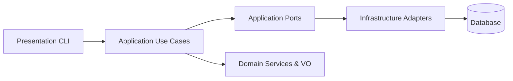

# Architecture Overview

## Цель
Показать слои и потоки данных в системе.

## Слои
- Domain: Value Objects, Domain Services (чистая логика, без внешних зависимостей).
- Application: Use Cases, DTO, Ports (Protocol'ы репозиториев, UoW, Clock).
- Infrastructure: Реализации портов (SQLAlchemy/InMemory), миграции Alembic, настройки, логирование.
- Presentation: CLI (API отложен).

## Зависимости
Domain <- Application <- Infrastructure <- Presentation (зависимость направлена к внутренним слоям).

## Порты и адаптеры
Application определяет Protocol'ы; Infrastructure реализует их: репозитории, UnitOfWork, сервисы баланса.

## Потоки данных
1. CLI парсит аргументы → вызывает Use Case → возвращает DTO.
2. DTO сериализуются: Decimal → str, datetime → ISO8601 (Z).
3. Use Case использует порты (repositories/UoW) для доступа к данным.
4. Domain Services (например баланс) обновляют кэш и выполняют вычисления.

## Диаграмма (Mermaid)

## Trading Balance Detailed
Конверсия валют к базовой: fallback курс = 1 если ставка неизвестна или совпадает с базовой. См. `GetTradingBalanceDetailed`.

## Decimal Quantization
Настройки: MONEY_SCALE (2), RATE_SCALE (10), ROUNDING (ROUND_HALF_EVEN). Функции: money_quantize, rate_quantize.

## Roadmap
- API (FastAPI) слой (NS18)
- Внешние провайдеры курсов (NS17)
- TTL архив FX событий (NS20)

## Historical Note
(Исторически) синхронный слой UoW и репозитории были помечены deprecated в I28 и удалены в I29. Текущая архитектура — полностью async (за исключением Alembic миграций, которые используют sync драйверы).
