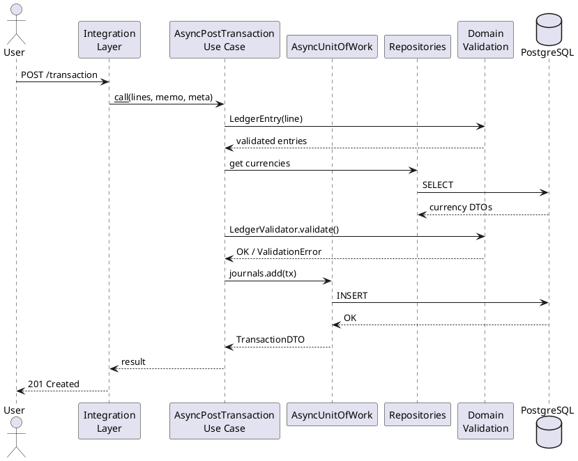

# Приоритизированный план исправлений

Дата: 2025-11-25  
Версия проекта: 1.0.2  
Методология: Repository Planning Graph (RPG)

---

## Резюме

На основе инвентаризации (`AUDIT_INVENTORY.md`), анализа удалённых компонентов (`AUDIT_REMOVED_COMPONENTS.md`) и матрицы соответствия (`AUDIT_CODE_MAPPING.md`) сформирован приоритизированный план исправления документации.

### Сводная статистика
- **Всего проблем**: 42
- **P0 (Критические)**: ✅ 6 проблем — ЗАВЕРШЕНО в Sprint S2 (2025-11-25)
- **P1 (Высокие)**: 8 проблем — ~16 часов
- **P2 (Средние)**: 15 проблем — ~24 часа
- **P3 (Низкие)**: 13 проблем — ~10 часов

**Общая оценка**: ~62 часа работы (8 спринтов по 6-8 часов)

---

## P0 - Критические (блокеры для пользователей) — ✅ ЗАВЕРШЕНО

**Статус**: Все 6 проблем P0 исправлены в Sprint S2 (2025-11-25)

Проблемы, которые **полностью блокировали** использование описанного функционала.

---

### 1. ✅ docs/FX_AUDIT.md — удалить ссылки на presentation.cli

**Статус**: ✅ ЗАВЕРШЕНО (2025-11-25, Sprint S2)

**Проблема**: Документ описывал CLI-команды для FX audit, которые ссылались на несуществующий модуль `presentation.cli.main`.

**Файлы**: `docs/FX_AUDIT.md`

**Выполненные изменения**:
- ✅ Секция "CLI Commands" заменена на "Python API Usage"
- ✅ Добавлены примеры `AsyncAddExchangeRateEvent`, `AsyncListExchangeRateEvents`
- ✅ Добавлен пример `AsyncPlanFxAuditTTL` для TTL планирования
- ✅ Обновлено введение: "через Python API" вместо "через CLI"
- ✅ Удалены все упоминания `presentation.cli.main`

**Оценка**: 3 часа  
**Фактически**: ~1 час  
**Спринт**: S2

---

### 2. ✅ docs/RUNNING_MIGRATIONS.md — заменить CLI пример на API

**Статус**: ✅ ЗАВЕРШЕНО (2025-11-25, Sprint S2)

**Проблема**: Строка 88 содержала пример CLI-команды `poetry run python -m presentation.cli.main trading detailed --base USD`

**Файлы**: `docs/RUNNING_MIGRATIONS.md:88`

**Выполненные изменения**:
- ✅ CLI команда заменена на Python API пример с `AsyncGetTradingBalanceDetailed`
- ✅ Добавлен рабочий пример с выводом результатов
- ✅ Пример интегрирован в секцию проверки после миграций

**Оценка**: 1 час  
**Фактически**: ~15 минут  
**Спринт**: S2

---

### 3. ✅ docs/TRADING_WINDOWS.md — заменить CLI примеры на API

**Статус**: ✅ ЗАВЕРШЕНО (2025-11-25, Sprint S2)

**Проблема**: Строки 56 и 60 содержали примеры CLI-команд `poetry run python -m presentation.cli.main trading raw`

**Файлы**: `docs/TRADING_WINDOWS.md:56,60`

**Выполненные изменения**:
- ✅ Оба CLI примера заменены на Python API с `AsyncGetTradingBalanceRaw`
- ✅ Показан пример без фильтров (все счета)
- ✅ Показан пример с фильтрами по времени и metadata
- ✅ Добавлены импорты и полный рабочий код

**Оценка**: 2 часа  
**Фактически**: ~20 минут  
**Спринт**: S2

---

### 4. ✅ README.md — добавить async версию GetAccountBalance

**Статус**: ✅ ЗАВЕРШЕНО (2025-11-25, Sprint S2)

**Проблема**: Строки показывали только sync версию `GetBalance`, которая deprecated

**Файлы**: `README.md` (секция "Интеграция через core")

**Выполненные изменения**:
- ✅ Добавлен async пример с `AsyncGetAccountBalance` рядом с sync
- ✅ Sync примеры помечены как "⚠️ Sync API (deprecated)"
- ✅ Async примеры помечены как "✅ Async API (рекомендуется)"
- ✅ Показаны примеры `AsyncPostTransaction` и `AsyncGetAccountBalance`

**Оценка**: 1 час  
**Фактически**: ~15 минут  
**Спринт**: S2

---

### 5. ✅ README.md — предупреждение о sync API deprecation

**Статус**: ✅ ЗАВЕРШЕНО (2025-11-25, Sprint S2)

**Проблема**: README показывал sync примеры без явного указания на deprecation статус

**Файлы**: `README.md` (начало файла)

**Выполненные изменения**:
- ✅ Добавлена секция "⚠️ Важно: Async-first Architecture" в начало README
- ✅ Указано, что версия 1.0.0+ использует async-first подход
- ✅ Отмечено, что sync API deprecated и будет удалён в v2.0.0
- ✅ Даны чёткие рекомендации: использовать `AsyncUnitOfWork` и `use_cases_async.*`

**Оценка**: 0.5 часа  
**Фактически**: ~10 минут  
**Спринт**: S2

---

### 6. ✅ docs/ARCHITECTURE_OVERVIEW.md — убрать Presentation из слоёв

**Статус**: ✅ ЗАВЕРШЕНО (2025-11-25, Sprint S2)

**Проблема**: Упоминание "Planned CLI/Presentation" с примерами путей к несуществующим файлам

**Файлы**: `docs/ARCHITECTURE_OVERVIEW.md`

**Выполненные изменения**:
- ✅ Удалены все упоминания CLI и presentation layer из навигации по исходникам
- ✅ Добавлено примечание: "Presentation/CLI layer был удалён в версии 1.0.0"
- ✅ Указано, что интеграторы создают собственный presentation layer
- ✅ Добавлена ссылка на `examples/telegram_bot/` как пример интеграции
- ✅ Обновлено описание FX TTL: убраны упоминания CLI

**Оценка**: 1 час  
**Фактически**: ~15 минут  
**Спринт**: S2

---

## P1 - Высокие (вводят в заблуждение)

Проблемы, которые не блокируют работу полностью, но **значительно затрудняют** понимание или приводят к ошибкам.

---

### 7. Создать docs/API_REFERENCE.md — Use Cases секция

**Проблема**: 10 из 18 use cases (56%) не документированы вообще

**Влияние**: Пользователи не знают о существовании половины функционала

**Решение**: Создать новый документ `docs/API_REFERENCE.md` с описанием всех 18 async use cases

**Структура**:
```markdown
# API Reference

## 1. Currency Management
- AsyncCreateCurrency
- AsyncSetBaseCurrency
- AsyncListCurrencies

## 2. Account Management
- AsyncCreateAccount
- AsyncGetAccount
- AsyncListAccounts

## 3. Ledger Operations
- AsyncPostTransaction
- AsyncListTransactionsBetween
- AsyncGetLedger
- AsyncGetAccountBalance

## 4. Trading Balance
- AsyncGetTradingBalanceRaw
- AsyncGetTradingBalanceDetailed

## 5. FX Audit
- AsyncAddExchangeRateEvent
- AsyncListExchangeRateEvents

## 6. FX Audit TTL
- AsyncPlanFxAuditTTL
- AsyncExecuteFxAuditTTL

## 7. Reporting
- AsyncGetParityReport
- AsyncGetTradingBalanceSnapshotReport
```

Для каждого use case:
- Сигнатура метода `__call__`
- Описание параметров
- Возвращаемое значение (DTO)
- Пример использования
- Возможные исключения

**Оценка**: 8 часов  
**Спринт**: S3  
**Зависимости**: Нет

---

### 8. docs/INTEGRATION_GUIDE.md — добавить async примеры

**Проблема**: Все примеры в INTEGRATION_GUIDE.md используют sync API (строки 78-99)

**Файлы**: `docs/INTEGRATION_GUIDE.md:78-99`

**Влияние**: Пользователи, читающие integration guide, будут использовать deprecated API

**Решение**: Добавить async версии для всех примеров

**Было** (строки 78-92):
```python
def post_deposit(uow_factory, clock, account: str, amount, currency: str, meta: dict):
    lines = [...]
    with uow_factory() as uow:
        use_case = PostTransaction(uow, clock)
        return use_case(lines=lines, memo="Deposit", meta=meta)
```

**Добавить**:
```python
async def post_deposit_async(uow_factory, clock, account: str, amount, currency: str, meta: dict):
    lines = [...]
    async with uow_factory() as uow:
        use_case = AsyncPostTransaction(uow, clock)
        return await use_case(lines=lines, memo="Deposit", meta=meta)
```

**Оценка**: 2 часа  
**Спринт**: S3  
**Зависимости**: Нет

---

### 9. README.md — секция "Quick Start" с async примером

**Проблема**: README не содержит "quick start" секции для новых пользователей

**Влияние**: Высокий порог входа для новых пользователей

**Решение**: Добавить секцию "Quick Start" после "Installation" с минимальным рабочим примером

```markdown
## Quick Start

Минимальный пример создания валют и счетов:

```python
import asyncio
from decimal import Decimal
from py_accountant.application.use_cases_async.currencies import AsyncCreateCurrency
from py_accountant.application.use_cases_async.accounts import AsyncCreateAccount
from py_accountant.infrastructure.persistence.sqlalchemy_async import AsyncSqlAlchemyUnitOfWork
from py_accountant.infrastructure.clock import SystemClock

async def main():
    # Инициализация
    uow = AsyncSqlAlchemyUnitOfWork("sqlite+aiosqlite:///:memory:")
    clock = SystemClock()
    
    # Создание валюты
    async with uow:
        currency_uc = AsyncCreateCurrency(uow)
        await currency_uc(code="USD", exchange_rate=None)  # базовая валюта
    
    # Создание счета
    async with uow:
        account_uc = AsyncCreateAccount(uow)
        await account_uc(full_name="Assets:Cash", currency_code="USD")

asyncio.run(main())
```
```

**Оценка**: 2 часа  
**Спринт**: S3  
**Зависимости**: Проблема #5 (async deprecation warning)

---

### 10. docs/INDEX.md — обновить навигацию

**Проблема**: INDEX.md не упоминает новые документы (AUDIT_*.md, будущие API_REFERENCE.md)

**Файлы**: `docs/INDEX.md`

**Влияние**: Пользователи не найдут важные документы

**Решение**: Обновить структуру навигации

Добавить секции:
- **Getting Started**: Quick Start, Installation, Migration from SDK
- **API Documentation**: API_REFERENCE.md, PORTS_REFERENCE.md, DTO_REFERENCE.md
- **Integration Guides**: INTEGRATION_GUIDE.md, INTEGRATION_GUIDE_AIOGRAM.md
- **Advanced Topics**: FX_AUDIT.md, TRADING_WINDOWS.md, PERFORMANCE.md
- **Meta Documentation**: AUDIT_*.md, DOCUMENTATION_FIX_*.md

**Оценка**: 1 час  
**Спринт**: S3  
**Зависимости**: Проблема #7 (API_REFERENCE.md)

---

### 11. examples/telegram_bot/README.md — синхронизация с INTEGRATION_GUIDE_AIOGRAM.md

**Проблема**: Два документа описывают одно и то же, но могут рассинхронизироваться

**Файлы**: 
- `examples/telegram_bot/README.md`
- `docs/INTEGRATION_GUIDE_AIOGRAM.md`

**Влияние**: Противоречивая информация в двух местах

**Решение**: Сделать telegram_bot/README.md кратким с ссылкой на полный гайд

```markdown
# Telegram Bot Example

Полный example Telegram бота на aiogram 3.x, интегрированного с py_accountant.

## Документация

Детальное руководство по интеграции см. в [INTEGRATION_GUIDE_AIOGRAM.md](INTEGRATION_GUIDE_AIOGRAM.md).

## Структура

- `main.py` — точка входа
- `uow.py` — реализация AsyncSqlAlchemyUnitOfWork
- `clock.py` — адаптер Clock
- `config.py` — настройки через pydantic-settings

## Быстрый запуск

1. Настроить `.env`:
   ```
   TELEGRAM_BOT_TOKEN=your-token
   PYACC__DATABASE_URL_ASYNC=postgresql+asyncpg://...
   ```

2. Применить миграции:
   ```bash
   poetry run alembic upgrade head
   ```

3. Запустить бота:
   ```bash
   poetry run python -m examples.telegram_bot.main
   ```

См. [полную документацию](INTEGRATION_GUIDE_AIOGRAM.md) для деталей.
```

**Оценка**: 1 час  
**Спринт**: S3  
**Зависимости**: Нет

---

### 12. Создать docs/MIGRATION_FROM_SDK.md

**Проблема**: Пользователи старых версий не знают, как мигрировать на core-only

**Влияние**: Затруднена миграция существующих проектов

**Решение**: Создать документ с пошаговой инструкцией миграции

**Содержание**:
1. Что изменилось в версии 1.0.0
2. Таблица соответствия старых и новых импортов
3. Примеры замены ApplicationService на use cases
4. Миграция sync на async
5. Чеклист проверки после миграции

**Оценка**: 4 часа  
**Спринт**: S4  
**Зависимости**: Нет

---

### 13. docs/ARCHITECTURE_OVERVIEW.md — обновить диаграмму

**Проблема**: Упоминание presentation layer в текстовом описании может означать, что PlantUML диаграмма тоже устарела

**Файлы**: 
- `docs/ARCHITECTURE_OVERVIEW.md:10` (ссылка на .puml)
- `docs/ARCHITECTURE_OVERVIEW.puml`

**Влияние**: Визуальная диаграмма может показывать несуществующие компоненты

**Решение**: 
1. Проверить ARCHITECTURE_OVERVIEW.puml на упоминания presentation
2. Удалить presentation layer из диаграммы
3. Перегенерировать SVG
4. Обновить текстовое описание диаграммы

**Оценка**: 2 часа  
**Спринт**: S4  
**Зависимости**: Проблема #6

---

### 14. Добавить диаграмму последовательности для PostTransaction

**Проблема**: Нет визуализации потока данных для основной операции

**Влияние**: Сложно понять взаимодействие компонентов

**Решение**: Создать PlantUML sequence diagram для AsyncPostTransaction



**Локация**: `docs/ARCHITECTURE_OVERVIEW.puml` (добавить отдельный файл или секцию)

**Оценка**: 2 часа  
**Спринт**: S6  
**Зависимости**: Проблема #13

---

## P2 - Средние (улучшения)

Проблемы, которые не блокируют работу, но **улучшат качество** документации и опыт пользователей.

---

### 15. Создать docs/PORTS_REFERENCE.md

**Проблема**: Async protocols (AsyncUnitOfWork, AsyncCurrencyRepository, и др.) не документированы

**Влияние**: Интеграторы не знают точных контрактов для реализации

**Решение**: Создать документ с описанием всех 6 async protocols

**Структура для каждого protocol**:
- Назначение
- Методы (сигнатуры)
- Пример реализации (skeleton)
- Используется в use cases (список)

**Оценка**: 4 часа  
**Спринт**: S4  
**Зависимости**: Проблема #7 (API_REFERENCE)

---

### 16. Создать docs/DTO_REFERENCE.md

**Проблема**: DTOs не документированы, пользователи не знают структуру данных

**Влияние**: Приходится читать исходный код для понимания структуры

**Решение**: Создать документ с описанием всех public DTOs

**Для каждого DTO**:
- Поля (тип, описание, обязательность)
- Пример JSON representation
- Используется в use cases (список)

**DTOs для документирования**:
- CurrencyDTO
- AccountDTO
- TransactionDTO
- EntryLineDTO
- RichTransactionDTO
- ExchangeRateEventDTO
- ParityReportDTO
- TradingRawBalanceDTO
- TradingDetailedBalanceDTO

**Оценка**: 5 часов  
**Спринт**: S5  
**Зависимости**: Проблема #7 (API_REFERENCE)

---

### 17. docs/FX_AUDIT.md — добавить "How It Works"

**Проблема**: Документ описывает CLI (который не работает), но не объясняет концепцию FX audit

**Файлы**: `docs/FX_AUDIT.md`

**Влияние**: После исправления CLI (проблема #1) документ станет чисто API справкой без контекста

**Решение**: Добавить секцию "How It Works" в начало документа

**Содержание**:
- Зачем нужен FX audit
- Как события курсов влияют на балансы
- Связь с Trading Balance
- TTL (Time-To-Live) политика для событий

**Оценка**: 3 часа  
**Спринт**: S5  
**Зависимости**: Проблема #1

---

### 18. docs/TRADING_WINDOWS.md — добавить концептуальное описание

**Проблема**: Документ про trading windows не объясняет концепцию, сразу переходит к CLI

**Файлы**: `docs/TRADING_WINDOWS.md`

**Влияние**: Пользователи не понимают, зачем нужен trading balance

**Решение**: Добавить секции:
- "What is Trading Balance" — концепция
- "Raw vs Detailed" — различия
- "Use Cases" — когда использовать
- "API Examples" — примеры (после исправления проблемы #3)

**Оценка**: 3 часа  
**Спринт**: S5  
**Зависимости**: Проблема #3

---

### 19. docs/INTEGRATION_GUIDE.md — конкретная реализация UoW

**Проблема**: Строки 56-73 показывают абстрактный skeleton MyUnitOfWork без деталей

**Файлы**: `docs/INTEGRATION_GUIDE.md:56-73`

**Влияние**: Непонятно, как реально реализовать UoW

**Решение**: Добавить полную реализацию AsyncSqlAlchemyUnitOfWork с комментариями

Или добавить ссылку:
```markdown
Полная реализация AsyncSqlAlchemyUnitOfWork:
- Код: `src/py_accountant/infrastructure/persistence/sqlalchemy_async/uow.py`
- Пример использования: `examples/telegram_bot/uow.py`
- Детальный гайд: [INTEGRATION_GUIDE_AIOGRAM.md](INTEGRATION_GUIDE_AIOGRAM.md#unit-of-work)
```

**Оценка**: 2 часа  
**Спринт**: S5  
**Зависимости**: Проблема #8

---

### 20. Создать docs/ERROR_HANDLING.md

**Проблема**: Нет централизованной документации по исключениям

**Влияние**: Пользователи не знают, какие исключения ожидать от use cases

**Решение**: Создать документ с классификацией ошибок

**Содержание**:
- `ValidationError` — некорректные данные (примеры)
- `ValueError` — отсутствие ресурсов (примеры)
- `DomainError` — нарушение бизнес-правил (примеры)
- Best practices обработки ошибок в integration layer
- Примеры error handling в async context

**Оценка**: 3 часа  
**Спринт**: S5  
**Зависимости**: Проблема #7 (API_REFERENCE)

---

### 21. README.md — добавить Badges

**Проблема**: README не содержит badges (версия, Python версия, статус CI)

**Влияние**: Не видна актуальность и статус проекта

**Решение**: Добавить badges в начало README

```markdown
# py-accountant


Чистая архитектура для бухгалтерского ядра...
```

**Оценка**: 0.5 часа  
**Спринт**: S6  
**Зависимости**: Нет

---

### 22. Создать docs/TESTING_GUIDE.md

**Проблема**: Нет документации по тестированию интеграций

**Влияние**: Интеграторы не знают best practices для тестирования

**Решение**: Создать guide по тестированию

**Содержание**:
- Unit тесты для use cases (с mock UoW)
- Integration тесты (с тестовой БД)
- Фикстуры pytest
- Примеры из `tests/`

**Оценка**: 4 часа  
**Спринт**: S6  
**Зависимости**: Нет

---

### 23. Создать docs/DEPLOYMENT.md

**Проблема**: Нет guide по deployment в production

**Влияние**: Непонятно, как правильно развернуть в production

**Решение**: Создать deployment guide

**Содержание**:
- Environment variables checklist
- Миграции в production (zero-downtime)
- Connection pooling best practices
- Logging configuration
- Monitoring recommendations

**Оценка**: 4 часа  
**Спринт**: S6  
**Зависимости**: Нет

---

### 24. docs/ACCOUNTING_CHEATSHEET.md — добавить примеры

**Проблема**: Cheatsheet содержит теорию, но нет примеров транзакций в коде

**Файлы**: `docs/ACCOUNTING_CHEATSHEET.md`

**Влияние**: Сложно понять, как теорию перевести в API вызовы

**Решение**: Добавить секцию "Examples in Code" с маппингом

Пример:
```markdown
## Example 1: Покупка товара за наличные

Бухгалтерские проводки:
- Дт Inventory (Актив) +100
- Кт Cash (Актив) -100

Код:
```python
lines = [
    EntryLineDTO(account="Assets:Inventory", side="debit", amount=100, currency_code="USD"),
    EntryLineDTO(account="Assets:Cash", side="credit", amount=100, currency_code="USD"),
]
await use_case(lines=lines, memo="Purchase inventory")
```
```

**Оценка**: 2 часа  
**Спринт**: S6  
**Зависимости**: Проблема #7 (API_REFERENCE)

---

### 25. docs/PARITY_REPORT.md — добавить пример API

**Проблема**: Документ описывает концепцию parity report, но нет примера использования

**Файлы**: `docs/PARITY_REPORT.md`

**Влияние**: Непонятно, как вызвать AsyncGetParityReport

**Решение**: Добавить секцию "Usage" с примером

```python
from py_accountant.application.use_cases_async.reporting import AsyncGetParityReport

async with uow_factory() as uow:
    use_case = AsyncGetParityReport(uow, clock)
    report = await use_case()
    
    print(f"Expected vs Actual Parity: {report.status}")
    for item in report.discrepancies:
        print(f"  {item.account}: expected {item.expected}, actual {item.actual}")
```

**Оценка**: 1 час  
**Спринт**: S5  
**Зависимости**: Проблема #7 (API_REFERENCE)

---

### 26. docs/PERFORMANCE.md — добавить benchmarks с async

**Проблема**: Performance doc может содержать устаревшие sync benchmarks

**Файлы**: `docs/PERFORMANCE.md`

**Влияние**: Метрики производительности не актуальны для async API

**Решение**: Обновить benchmarks для async use cases

**Оценка**: 3 часа  
**Спринт**: S7  
**Зависимости**: Нет

---

### 27. Создать docs/INTEGRATION_GUIDE_FASTAPI.md

**Проблема**: Есть отличный aiogram guide, но нет для других популярных фреймворков

**Влияние**: Интеграторы FastAPI не имеют reference

**Решение**: Создать guide по аналогии с INTEGRATION_GUIDE_AIOGRAM.md

**Содержание**:
- Структура FastAPI проекта
- Dependency Injection (Depends)
- Реализация UoW с FastAPI lifespan
- Error handling (exception handlers)
- OpenAPI schema
- Testing с TestClient

**Оценка**: 6 часов  
**Спринт**: S7  
**Зависимости**: Проблемы #7, #15, #16

---

### 28. Создать docs/INTEGRATION_GUIDE_DJANGO.md

**Проблема**: Нет guide для Django интеграции

**Влияние**: Django пользователи не знают best practices

**Решение**: Создать Django integration guide

**Содержание**:
- Django ORM vs py_accountant (разделение БД)
- Интеграция UoW с Django transaction middleware
- Django management commands
- Celery tasks с py_accountant
- Django REST Framework views

**Оценка**: 6 часов  
**Спринт**: S7  
**Зависимости**: Проблемы #7, #15, #16

---

### 29. Обновить alembic/README.md

**Проблема**: Alembic README может быть outdated

**Файлы**: `alembic/README.md`

**Влияние**: Непонятно, как работать с миграциями

**Решение**: Обновить или создать ссылку на RUNNING_MIGRATIONS.md

**Оценка**: 1 час  
**Спринт**: S3  
**Зависимости**: Проблема #2 (RUNNING_MIGRATIONS исправлен)

---

## P3 - Низкие (косметические улучшения)

Улучшения, которые не влияют на функциональность, но повышают **общее качество** документации.

---

### 30. Проверить все внутренние ссылки между документами

**Проблема**: Ссылки типа `[см. INTEGRATION_GUIDE.md](INTEGRATION_GUIDE.md)` могут быть broken

**Влияние**: Неудобная навигация

**Решение**: Пройтись по всем .md файлам и проверить ссылки

Инструмент: `markdown-link-check` или manual review

**Оценка**: 2 часа  
**Спринт**: S8  
**Зависимости**: Все документы созданы

---

### 31. Унифицировать форматирование кода в документах

**Проблема**: Разный стиль кодовых блоков (с/без языка, отступы)

**Влияние**: Визуально неоднородная документация

**Решение**: Привести к единому стилю:
- Всегда указывать язык: ```python, ```bash, ```yaml
- Консистентные отступы (4 пробела)
- Единый стиль импортов (от общего к частному)

**Инструмент**: `prettier` + `markdownlint`

**Оценка**: 3 часа  
**Спринт**: S8  
**Зависимости**: Нет

---

### 32. Добавить Table of Contents в длинные документы

**Проблема**: Документы >1000 строк (INTEGRATION_GUIDE_AIOGRAM.md) сложно навигировать

**Влияние**: Сложно найти нужную секцию

**Решение**: Добавить автогенерируемый TOC в начало документов >500 строк

Инструмент: `markdown-toc` или GitHub auto-TOC

**Оценка**: 1 час  
**Спринт**: S8  
**Зависимости**: Нет

---

### 33. Создать GLOSSARY.md

**Проблема**: Термины (UoW, DTO, Ledger Entry, etc.) не имеют централизованных определений

**Влияние**: Новички могут путаться в терминологии

**Решение**: Создать `docs/GLOSSARY.md` с алфавитным списком терминов

**Примеры терминов**:
- Account — иерархический счёт
- Base Currency — базовая валюта
- Debit/Credit — дебет/кредит
- DTO — Data Transfer Object
- Entry Line — строка проводки
- Ledger — главная книга
- Protocol — typing.Protocol интерфейс
- Quantization — округление денежных величин
- Repository — паттерн Repository
- Side — сторона проводки (debit/credit)
- Trading Balance — торговый баланс
- TTL — Time To Live
- Unit of Work — паттерн UnitOfWork

**Оценка**: 2 часа  
**Спринт**: S8  
**Зависимости**: Нет

---

### 34. docs/PROJECT_CRIB_SHEET.md — расширить примеры

**Проблема**: Crib sheet очень короткий (37 строк)

**Влияние**: Мало практической ценности

**Решение**: Расширить с практическими quick reference примерами

**Добавить**:
- Частые команды (миграции, тесты, линтинг)
- Частые паттерны кода (создание UoW, вызов use case)
- Troubleshooting чеклист

**Оценка**: 2 часа  
**Спринт**: S8  
**Зависимости**: Нет

---

### 35. Добавить emoji/icons для визуальных маркеров

**Проблема**: Текстовые документы монотонны

**Влияние**: Снижение читаемости

**Решение**: Добавить консистентные emoji для типов информации:
- ✅ Рекомендуется / Best practice
- ⚠️ Предупреждение / Deprecation
- ❌ Не рекомендуется / Неправильно
- 📝 Примечание
- 🔍 Детали / Deep dive
- 🚀 Quick start
- 🐛 Troubleshooting

**Оценка**: 1 час  
**Спринт**: S8  
**Зависимости**: Нет

---

### 36. Создать CONTRIBUTING.md

**Проблема**: Нет guide для контрибьюторов

**Влияние**: Сложно внести вклад в проект

**Решение**: Создать документ с правилами контрибуции

**Содержание**:
- Code style (ruff, black)
- Commit message format
- PR checklist
- Testing requirements
- Documentation requirements

**Оценка**: 2 часа  
**Спринт**: S8  
**Зависимости**: Нет

---

### 37. Создать CHANGELOG.md

**Проблема**: История изменений хранится только в rpg_py_accountant.yaml

**Влияние**: Пользователи не видят changelog в удобном формате

**Решение**: Генерировать CHANGELOG.md из rpg_py_accountant.yaml

Или вести вручную в стандартном формате keepachangelog.com

**Оценка**: 1 час  
**Спринт**: S8  
**Зависимости**: Нет

---

### 38. Проверить корректность примеров через doctests

**Проблема**: Примеры кода в документации не тестируются

**Влияние**: Примеры могут сломаться при рефакторинге

**Решение**: Настроить CI job для проверки примеров

**Варианты**:
1. Извлекать ```python блоки и запускать через pytest
2. Использовать `pytest --doctest-glob="*.md"`
3. Создать тесты, которые импортируют примеры

**Оценка**: 4 часа  
**Спринт**: S8  
**Зависимости**: Все примеры кода исправлены

---

### 39. Настроить Sphinx или MkDocs для генерации HTML docs

**Проблема**: Документация существует только как Markdown файлы

**Влияние**: Нет красивого веб-интерфейса для документации

**Решение**: Настроить MkDocs Material для генерации статического сайта

**Задачи**:
- Установить mkdocs-material
- Создать mkdocs.yml
- Настроить структуру навигации
- Настроить GitHub Pages для хостинга
- Добавить CI job для деплоя

**Оценка**: 6 часов  
**Спринт**: S8  
**Зависимости**: Все документы созданы

---

### 40. Добавить диаграмму зависимостей модулей

**Проблема**: Нет визуализации dependency graph

**Влияние**: Сложно понять архитектуру

**Решение**: Создать PlantUML component diagram

**Содержание**:
- Слои (Domain → Application → Infrastructure)
- Зависимости между модулями
- External dependencies (SQLAlchemy, asyncpg)

**Оценка**: 2 часа  
**Спринт**: S8  
**Зависимости**: Проблема #13 (диаграммы)

---

### 41. Создать видео tutorial (опционально)

**Проблема**: Нет видео материалов

**Влияние**: Некоторые пользователи предпочитают видео

**Решение**: Записать screencast с основными операциями

**Содержание** (5-10 минут):
- Установка и настройка
- Создание первой транзакции
- Получение баланса
- Обзор architecture

**Оценка**: 8 часов (съёмка + монтаж)  
**Спринт**: Опционально (после S8)  
**Зависимости**: Все документы готовы

---

### 42. Перевести ключевые документы на английский

**Проблема**: Вся документация на русском языке

**Влияние**: Ограничена международная аудитория

**Решение**: Перевести минимум README.md и API_REFERENCE.md на английский

**Оценка**: 10 часов  
**Спринт**: Опционально (после S8)  
**Зависимости**: Все документы финализированы

---

## Сводка по спринтам

| Спринт | Проблемы | Оценка | Фокус |
|--------|----------|--------|-------|
| **S2** | #1-6 | 11.5 часов | 🔴 Критические блокеры (CLI → API) |
| **S3** | #7-11, #29 | 15 часов | 📚 API Reference, async примеры, навигация |
| **S4** | #12-15 | 12 часов | 🏗️ Архитектура, миграция, порты |
| **S5** | #16-20, #25 | 20 часов | 📖 DTOs, концептуальные описания, ошибки |
| **S6** | #21-24 | 10.5 часов | 🧪 Testing, deployment, диаграммы |
| **S7** | #26-28 | 15 часов | 🔌 Интеграции (FastAPI, Django), performance |
| **S8** | #30-40 | 28 часов | ✨ Polish (форматирование, CI, MkDocs) |
| **Опционально** | #41-42 | 18 часов | 🌍 Видео, переводы |

**Итого**: ~112 часов (62 основных + 50 опциональных)

---

## Метрики успеха

После завершения спринтов S2-S8:

### Quantitative Metrics
- ✅ **0 неработающих примеров кода** (было: 4)
- ✅ **100% use cases документированы** (было: 44%)
- ✅ **100% async protocols документированы** (было: 33%)
- ✅ **80%+ DTOs документированы** (было: 30%)
- ✅ **CI проверка примеров** (было: нет)
- ✅ **HTML документация (MkDocs)** (было: только MD)

### Qualitative Metrics
- ✅ Документация не содержит ссылок на удалённые компоненты
- ✅ Все примеры работают и протестированы
- ✅ Есть integration guides для минимум 3 фреймворков (aiogram, FastAPI, Django)
- ✅ Новый пользователь может запустить первую транзакцию за <30 минут
- ✅ Документация соответствует принципу "single source of truth"

---

## История изменений

| Дата | Версия | Изменения |
|------|--------|-----------|
| 2025-11-25 | 1.0 | Первичный приоритизированный план (Спринт S1) |

---

**Следующий шаг**: Обновление `rpg_py_accountant.yaml` и `prompts/sprint_graph.yaml`

