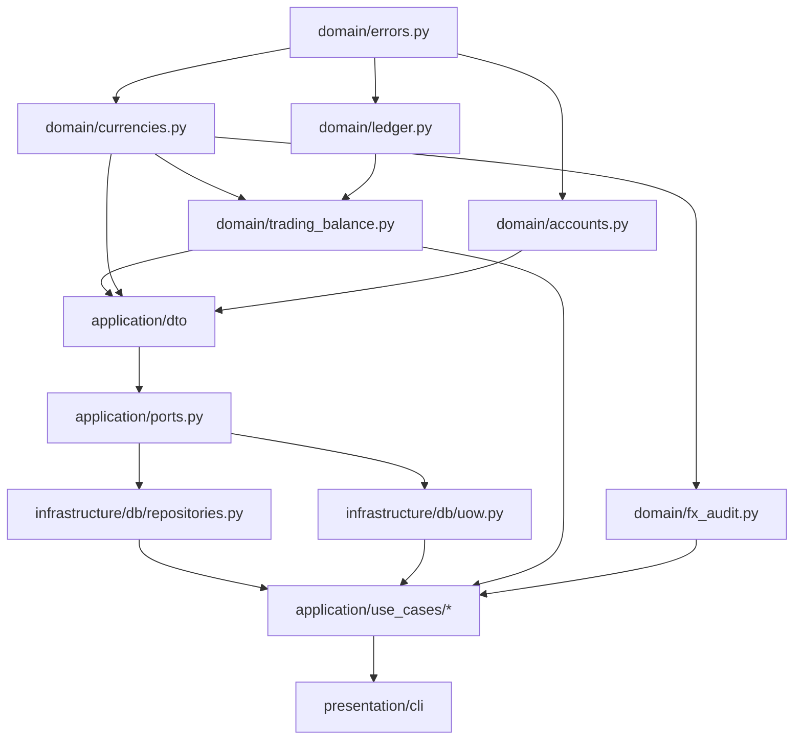

# Техническое задание: Рефакторинг проекта `py_accountant` по методике RPG

Дата: 2025-11-11
Версия: 1.0
Автор: Архитектурный аудит (RPG)

## 0. Цель рефакторинга
Упростить архитектуру, убрать оверинжиниринг и антипаттерны, повысить надёжность и предсказуемость поведения. Сфокусироваться на одном (async) пути выполнения, минимизировать магию, стабилизировать интерфейсы, перенести бизнес‑логику из инфраструктуры в домен.

## 1. Выявленные антипаттерны и оверинжиниринг
| Код/Компонент | Антипаттерн | Проявление | Риск | Рекомендация |
|---------------|-------------|------------|------|--------------|
| `presentation/async_bridge.py` | Скрытый глобальный кэш ресурсов | Кэширование UoW по стеку теста через introspection | Непредсказуемость, утечки, повторное использование закрытой сессии | Убрать кэш, создавать UoW per command invocation |
| `async_bridge._uow_key()` | Магическое поведение | Инспекция стека для определения тестового контекста | Ломкость в CI, сложная отладка | Удалить инспекцию; передавать явный контекст |
| `AsyncSqlAlchemyUnitOfWork` | Избыточная сложность транзакций | Свой backoff/ретраи commit, логика timeout injection | Скрытые гонки, трудно тестировать, дублирование logics SQLAlchemy | Упростить: единичный commit, убрать retry (перенести retry в внешний слой при необходимости) |
| `repositories_async.py` (Trading balance, ledger) | Нарушение слоя домена / Анемичная модель | Агрегации и бизнес‑правила внутри репозитория | Трудно переиспользовать логику с другим источником | Вынести расчёты в `domain/services/` |
| DTO `TradingBalanceLineDTO` | Расширяющий «грузовой» объект | Много опциональных converted_* полей + meta | Повышение связности, сложность сериализации | Разделить: BaseTradingBalanceLineDTO + DetailedConversionInfo DTO |
| Sync vs Async протоколы (`ports.py`) | Раздвоение контрактов | Две независимые иерархии Protocol | Дублирование тестов, усложнение эволюции | Ввести единый Async-ориентированный контракт; sync слой убрать |
| `repositories.py` (raise ImportError) | Сломанный мягкий депрекейт | Немедленный ImportError при любом обращении | Нарушение обратной совместимости | Заменить stub с предупреждением + переходный адаптер (если нужно) |
| `run_sync()` + sync фасады | Layer Leakage | Синхронное API поверх чисто async домена | Удерживает «двойную» поверхность | Перейти к полностью async CLI (Typer / click>=8 с asyncio) |
| Кэш балансов в БД (`BalanceORM`) | Потенциальный prematurе persistence | Хранение временных расчётных данных | Рост объёма БД, несогласованность TTL | Перенести кеш в in‑memory (LRU) или материализованные view, либо убрать пока |
| Массовые операции (`bulk_upsert_rates`) | Чрезмерная логика в репозитории | Фильтрация base currency в коде | Возможные race conditions, неатомарность | Перенести в use case + транзакция с единой командой |
| Отсутствие явной границы домена | Архитектурная эрозия | Доменные вычисления (баланс, конверсия) размазаны | Сложность модульного тестирования | Ввести четкие сервисы: CurrencyService, BalanceService |
| Использование `Decimal` без локальной контекстной изоляции | Скользящая точность | Отсутствие явного контекста при вычислениях | Потенциальное различие округлений | Ввести quantize utility через единый money/rate context |
| Инструменты TTL/архива добавлены в репозиторий | Признак «God Repository» | Слишком много обязанностей | Снижение SRP | Выделить FXEventsArchivalService |

## 2. Целевые архитектурные принципы
1. Один async путь (CLI тоже async).
2. Доменная логика вне инфраструктуры: агрегации, конверсия, бизнес‑правила.
3. Единственный слой интерфейсов (AsyncPorts) + адаптеры.
4. Явные сервисы домена (CurrencyService, LedgerService, TradingBalanceService, FxAuditService).
5. Минимум DTO вариантов: разделить детализированный и простой отчёты.
6. Прозрачная загрузка контекста (нет скрытого кэша UoW).
7. Тест‑первый порядок реализации по RPG (топологический).
8. Упрощённый UoW (без retry; при необходимости внешний retry-декоратор).

## 3. RPG Этап 1 — Граф возможностей (функциональный уровень)
```
py_accountant
├─ currencies
│  ├─ manage_base (set_base, clear_base)
│  ├─ upsert_currency (create/update)
│  └─ bulk_update_rates
├─ accounts
│  ├─ create_account
│  └─ list_accounts / get_account
├─ ledger
│  ├─ post_transaction (balance validation)
│  ├─ list_transactions_between
│  ├─ get_ledger (pagination, filtering)
│  └─ get_account_balance
├─ trading_balance
│  ├─ aggregate_raw (per currency debit/credit)
│  └─ aggregate_converted (detailed with rates/fallbacks)
├─ fx_audit
│  ├─ add_rate_event
│  ├─ list_rate_events
│  └─ ttl_archival (archive/delete old)
├─ reporting
│  ├─ parity_report
│  ├─ performance_report
│  └─ fx_audit_report
├─ cli
│  ├─ currency_commands
│  ├─ account_commands
│  ├─ ledger_commands
│  ├─ trading_balance_commands
│  └─ fx_audit_commands
```
Потоки данных (упрощённые):
`post_transaction → trading_balance.aggregate_raw → trading_balance.aggregate_converted → reporting`
`bulk_update_rates → fx_audit.add_rate_event → trading_balance.aggregate_converted`

## 4. RPG Этап 2 — Планирование реализации (структурный уровень)
### Новая упрощённая структура директорий
```
src/
  domain/
    currencies.py        # Value objects, правила base currency
    accounts.py          # Value objects + валидации
    ledger.py            # Правила баланса транзакции
    trading_balance.py   # Агрегации и конверсия
    fx_audit.py          # Сервис TTL/архивирования
    errors.py            # DomainError, ValidationError
    quantize.py          # money_quantize, rate_quantize
  application/
    ports.py             # Async*Repository + AsyncUnitOfWork Protocol (единый)
    use_cases/
      currencies.py
      accounts.py
      ledger.py
      trading_balance.py
      fx_audit.py
      reporting.py
  infrastructure/
    db/
      models.py
      repositories.py    # async only; CRUD + простые выборки
      uow.py              # простой AsyncUoW (enter/exit + commit/rollback)
    config.py
    logging.py
    quantize_context.py  # Настройки Decimal (context factory)
  presentation/
    cli/
      main.py            # Typer/async commands
      currencies.py
      accounts.py
      ledger.py
      trading_balance.py
      fx_audit.py
  tests/
    unit/
      domain/ (новые тесты на чистую логику)
      application/ (use case контракты)
    integration/
      db/ (репозитории + uow)
      cli/ (end-to-end команда)
```
### Интерфейсы (сокращённо)
```
class AsyncUnitOfWork(Protocol):
    async def __aenter__(self) -> Self: ...
    async def __aexit__(...): ...
    async def commit(self) -> None: ...
    @property
    def currencies(self) -> AsyncCurrencyRepository: ...
    # и т.д.

class AsyncCurrencyRepository(Protocol):
    async def get(code: str) -> CurrencyDTO | None: ...
    async def upsert(dto: CurrencyDTO) -> CurrencyDTO: ...
    async def set_base(code: str) -> None: ...
```
Умышленно упрощено: убираем дублирующие «list_all vs get_base vs clear_base»; оставляем только используемое; остальные функции — через use case.

### Топологический порядок (высокоуровневый)
1. Domain errors / quantize utilities.
2. Domain value objects (currencies, accounts, ledger lines).
3. Domain services: ledger balance validation, trading balance aggregation, fx audit TTL.
4. Application ports (обновлённые Protocol).
5. DTO переразделение (простые и подробные отчёты).
6. Infrastructure: простые модели (миграции адаптированы).
7. Async repositories (чистые CRUD + простые запросы).
8. Simplified AsyncUoW.
9. Use cases (orchestrators поверх domain + repositories).
10. Async CLI (Typer). Удаление `async_bridge`.
11. Миграция тестов: сначала unit/domain, затем application, далее integration.

## 5. RPG Этап 3 — План генерации/реализации (Work Graph)
### Узлы и зависимости (Mermaid)

### Порядок задач (с чеклистом и критериями приемки)
1. [ ] Создать `domain/errors.py`; покрыть тестом `test_domain_errors_raise`.
2. [ ] Вынести quantize в `domain/quantize.py`; тесты на округление MONEY/RATE.
3. [ ] Реализовать `domain/currencies.py` (правило base singleton без тотального UPDATE *); тест: set_base не удаляет другие rate значения.
4. [ ] Реализовать `domain/ledger.py` (балансировка транзакции); тест: multi-currency с fallback=1.
5. [ ] Реализовать `domain/trading_balance.py` (raw + converted, выделить Detailed DTO); тесты: raw aggregation, converted with fallback.
6. [ ] Реализовать `domain/fx_audit.py` (TTL выборка + архив логики); тест: архив по cutoff.
7. [ ] Обновить `application/ports.py` → единые Async Protocol (без sync и дублирования docstring).
8. [ ] Пересобрать DTO: удалить converted_* из базового; добавить `TradingBalanceDetailedDTO`.
9. [ ] Простые SQLAlchemy модели без логики агрегации.
10. [ ] Написать новые async repositories: только CRUD + простые выборки (без агрегации, балансировки).
11. [ ] Упростить UoW (убрать retry, timeout injection). Тест: порядок commit/rollback.
12. [ ] Use cases обновлены на доменные сервисы (CurrencyService, LedgerService...).
13. [ ] Переписать CLI на Typer async; каждый use case → отдельная команда; тест E2E.
14. [ ] Удалить `presentation/async_bridge.py` и кэш UoW, заменить на фабрику UoW per command.
15. [ ] Удалить `repositories.py` (sync) или заменить на тонкий адаптер с DeprecationWarning (если внешние зависимости).
16. [ ] Миграция тестов: переименовать/адаптировать, убрать допустимые flaky retry проверки.
17. [ ] Метрики до/после (LOC, cyclomatic, время тестов).
18. [ ] Обновить документацию: ARCHITECTURE_OVERVIEW.md, MIGRATION_HISTORY.md (описать переход).

### Критерии приемки
- 100% зеленые тесты (unit + integration + docs).
- Снижение среднего cyclomatic complexity UoW классов ≥50%.
- Удаление файла `async_bridge.py` и отсутствуют импорты на него.
- DTO TradingBalanceLine без converted_* полей; новые detailed DTO покрыты тестом.
- Нет использования stack introspection для ключей ресурсов.
- Отчёт о метриках приложен (LOC до/после, время прогона тестов).

## 6. План миграции данных / совместимость
- Модели БД: не менять имена таблиц; только убрать неиспользуемые поля, если нет потребности (пока — без удаления).
- Balance cache: оставить таблицу до решения (этап наблюдения) → пометить deprecated.
- FX events archive: структура прежняя, логика перенесена в сервис.

## 7. Риски и их смягчение
| Риск | Митигирующее действие |
|------|-----------------------|
| Потеря обратной совместимости sync API | Семантически заменить публичные sync функции на async и задокументировать переход; предоставить шорткат скрипт для legacy |
| Ошибки при переносе доменной логики | Тесты домена до миграции репозиториев |
| Рост времени миграции тестов | Автоматическая генерация baseline отчёта покрытия перед началом |
| Скрытые зависимости на `async_bridge` | Глобальный поиск `async_bridge` перед удалением + временный shim |

## 8. Метрики успеха
- LOC инфраструктуры минус ≥15%.
- Время полного тестового прогона ↓ хотя бы на 10%.
- Количество Protocol классов ↓ с N (текущее) до N/2.
- Отсутствие глобальных mutable singletons (кроме допустимых конфигов).

## 9. Изменения документации
Обновить:
- `ARCHITECTURE_OVERVIEW.md`: убрать sync путь, описать единый async CLI.
- `MIGRATION_HISTORY.md`: новый раздел "Async Consolidation".
- Добавить раздел в README "Переход на полностью асинхронное ядро".

## 10. Post-Refactor Roadmap (итеративные улучшения)
1. Observability: добавить трассировку (OpenTelemetry) — опционально.
2. Rate Providers: вынести внешние источники курсов как отдельные адаптеры (NS17).
3. Перевод balance cache на материализованный view / in-memory.
4. Добавить политики ретрая на уровне orchestration (не в UoW).

## 11. Формат выполнения (RPG Execution Loop)
Для каждого узла графа:
1. Сгенерировать спецификацию интерфейса (docstring + сигнатура).
2. Написать минимальный тест (happy + 1 edge case).
3. Реализовать узел.
4. Запустить тесты; при падении — до 8 итераций исправлений.
5. Commit только после успешного прохождения.

## 12. Примечания
- Все сохранённые retry/timeout механики сейчас признаны преждевременной оптимизацией — переносятся на уровень orchestration когда появятся реальные SLA.
- Deprecated элементы помечаются `@deprecated` (через комментарий) и удаляются по завершении релиза.

---
Конец ТЗ.

