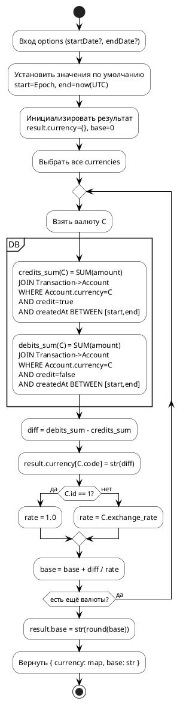

# Trading Balance Diagrams

В этом файле представлены визуализации алгоритма `Book.trading_balance()`.

## PlantUML (основной поток)


## Mermaid (эквивалентный поток)
```mermaid
flowchart TD
    A([Вход options: startDate?, endDate?]) --> B([Задать start = Epoch, end = now UTC])
    B --> C([Инициализировать result.currency = {}, base = 0])
    C --> D([Выбрать все currencies])
    D --> E{Есть ещё валюты?}
    E -->|Да| F([Взять валюту C])
    F --> G([credits_sum(C)])
    G --> H([debits_sum(C)])
    H --> I([diff = debits_sum - credits_sum])
    I --> J([result.currency[C.code] = to_string(diff)])
    J --> K{C.id == 1?}
    K -->|Да| L([rate = 1.0])
    K -->|Нет| M([rate = C.exchange_rate])
    L --> N([base = base + diff / rate])
    M --> N
    N --> E
    E -->|Нет| O([result.base = to_string(round(base))])
    O --> P([return { currency, base }])
```

## Примечания
- Mermaid-диаграмма использует синтаксис `flowchart TD` и избегает угловых скобок `< >` в подписях, чтобы не конфликтовать с парсером.
- Узлы упрощены, длинные подписи разбиты на запятые/пробелы, без Markdown-разметки.
- Отдельный файл с Mermaid-диаграммой: см. `TRADING_BALANCE.mmd`.
- PlantUML удобен для генерации PNG/SVG; при необходимости можно автоматизировать экспорт.
